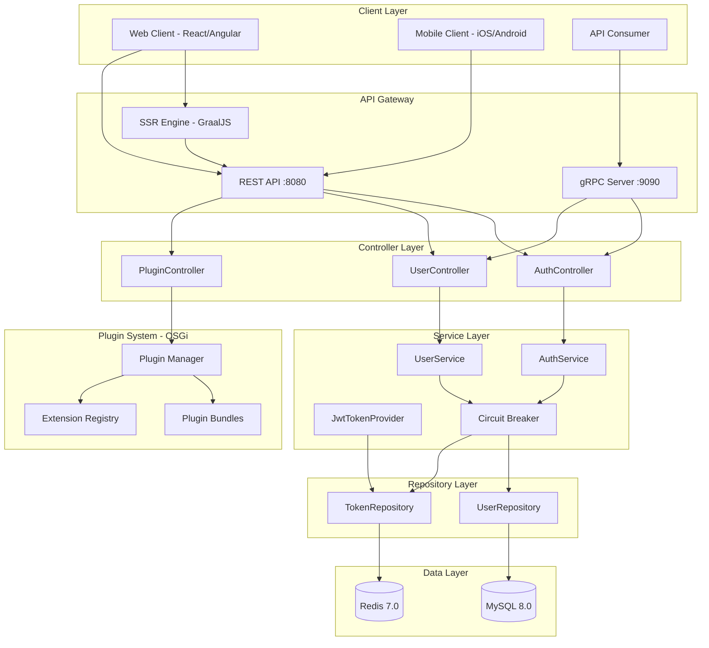

# Arcana Architecture Series: Vision and Philosophy

## Table of Contents
- [Our Mission](#our-mission)
- [The Arcana Philosophy](#the-arcana-philosophy)
- [Twenty Years of Wisdom](#twenty-years-of-wisdom)
- [The Arcana Ecosystem](#the-arcana-ecosystem)
- [Core Principles](#core-principles)
- [Architecture Overview](#architecture-overview)
- [Who Benefits from Arcana](#who-benefits-from-arcana)
- [Technology Stack](#technology-stack)
- [Getting Started](#getting-started)
- [Contributing Back](#contributing-back)

---

## Our Mission

> **"To empower humanity with production-ready architecture, born from 20 years of software development wisdom, enabling everyone to build meaningful applications that serve the global community."**

The Arcana series represents more than just code—it embodies a commitment to give back to Earth and its inhabitants. We use the planet's resources; it is our privilege and responsibility to return value to the world that sustains us.

---

## The Arcana Philosophy

### Why "Arcana"?

The word "Arcana" means "secrets" or "mysteries"—the hidden knowledge that transforms the ordinary into the extraordinary. In software development, this knowledge comes from:

- **20 years of real-world experience** across mobile, web, and cloud platforms
- **Lessons learned** from successes and failures in enterprise environments
- **Battle-tested patterns** that solve recurring problems elegantly
- **Architectural wisdom** distilled into reusable, production-ready code

We believe this knowledge should not remain hidden. Instead, it should be shared freely with:

- 🎓 **Students** beginning their journey in software development
- 🏢 **Enterprises** seeking to accelerate their digital transformation
- 👨‍💻 **Individual developers** building their dreams
- 🌍 **The global community** advancing human progress through technology

### Our Core Belief

**Time is humanity's most precious resource.** Instead of forcing each generation to rediscover the same architectural patterns, we provide a foundation that enables:

- **Rapid application development** without sacrificing quality
- **Learning by example** from production-grade code
- **Focus on innovation** rather than reinventing the wheel
- **Sustainable software** that scales with business needs

---

## Twenty Years of Wisdom

The Arcana series is not theoretical—it represents accumulated knowledge from two decades of building software across multiple platforms and industries:

### Lessons Embodied in Arcana

| Wisdom | Implementation in Arcana |
|--------|--------------------------|
| **Clean Architecture Matters** | Three-layer separation (Controller/Service/Repository) with clear boundaries |
| **Flexibility is Key** | 5 deployment modes from monolithic to Kubernetes in a single codebase |
| **Performance Counts** | Dual-protocol support (gRPC + REST) with 2.5x average performance gain |
| **Extensibility Wins** | OSGi plugin system enabling hot-deployment without restarts |
| **Security First** | JWT + OAuth2, TLS/mTLS, plugin sandboxing, JAR signature verification |
| **Resilience is Essential** | Circuit breakers preventing cascading failures across distributed systems |
| **Modern Stack** | Java 25, Spring Boot 4.0, cutting-edge technologies with stability |
| **Cloud-Native Ready** | Kubernetes-ready with distributed plugin sync via Redis and PVC |
| **Platform Consistency** | Unified architecture across iOS, Android, Angular, Python, and Spring Boot |

### What Makes Arcana Different?

Unlike typical framework demos or tutorials, Arcana provides:

- ✅ **Production-ready code** with comprehensive testing (297 tests, 100% passing)
- ✅ **Real security implementations** not placeholder TODO comments
- ✅ **Actual performance optimizations** backed by benchmarks
- ✅ **Complete deployment strategies** for development through production
- ✅ **Extensible architecture** proven in enterprise environments
- ✅ **Fault-tolerant systems** with circuit breakers and graceful degradation
- ✅ **Documentation that teaches** architectural decisions, not just API usage

---

## The Arcana Ecosystem

The Arcana architecture spans the entire application stack, providing consistent patterns across all platforms:

### 1. **Mobile Platforms**

#### [Arcana iOS](https://github.com/jrjohn/arcana-ios)
- Native iOS development with Swift
- Clean Architecture / MVVM patterns
- Reactive programming with Combine
- Offline-first capabilities
- Secure keychain management

#### [Arcana Android](https://github.com/jrjohn/arcana-android)
- Native Android development with Kotlin
- Clean Architecture / MVVM patterns
- Reactive programming with Coroutines and Flow
- Room database with migration strategies
- Material Design 3 implementation

### 2. **Web Platforms**

#### [Arcana Angular](https://github.com/jrjohn/arcana-angular)
- Enterprise-grade Angular application
- NgRx state management
- Lazy loading and code splitting
- Server-side rendering (SSR) support
- Progressive Web App (PWA) capabilities
- Internationalization (i18n) ready

### 3. **Cloud Backend Platforms**

#### [Arcana Cloud - Spring Boot](https://github.com/jrjohn/arcana-cloud-springboot)
- Enterprise Java microservices platform
- **Dual-protocol architecture** (gRPC 2.5x faster than REST)
- **OSGi plugin system** (Apache Felix) for hot-deployable extensions
- **Server-side rendering** with GraalJS for React and Angular
- **Five deployment modes** with full plugin synchronization
- **Circuit breaker pattern** for fault tolerance
- Kubernetes-ready with horizontal scaling

#### [Arcana Cloud - Python](https://github.com/jrjohn/arcana-cloud-python)
- FastAPI-based microservices
- Async/await patterns throughout
- SQLAlchemy ORM with Alembic migrations
- Pydantic for data validation
- Docker and Kubernetes deployment
- Plugin architecture with dynamic loading

### Platform Interoperability

All Arcana platforms share:

- **Consistent API contracts** (RESTful and gRPC)
- **Unified authentication** (OAuth2 + JWT)
- **Common design patterns** (Repository, Service, Clean Architecture)
- **Compatible data models** enabling seamless integration
- **Shared security principles** across the stack

---

## Core Principles

### 1. **Clean Architecture**

Every Arcana project follows clean architecture principles:

```
┌─────────────────────────────────────────┐
│         Presentation Layer              │
│   (Controllers, Views, ViewModels)      │
├─────────────────────────────────────────┤
│          Business Layer                 │
│      (Services, Use Cases)              │
├─────────────────────────────────────────┤
│           Data Layer                    │
│  (Repositories, Data Sources)           │
└─────────────────────────────────────────┘
```

**Benefits:**
- Clear separation of concerns
- Testable business logic independent of frameworks
- Easy to understand and maintain
- Supports team collaboration with minimal conflicts

### 2. **Flexibility Over Dogma**

Arcana recognizes that one size does not fit all:

- **Monolithic** for rapid development and simple deployments
- **Layered microservices** for gradual scaling
- **Kubernetes deployment** for cloud-native applications
- **Protocol choice** (HTTP REST vs gRPC) based on performance needs
- **Plugin architecture** for customization without forking

### 3. **Developer Experience**

Good architecture should empower developers:

- 📚 **Comprehensive documentation** with visual diagrams
- 🧪 **Extensive test coverage** demonstrating best practices
- 🔧 **Development scripts** for common operations
- 🐳 **Docker support** for consistent environments
- 📊 **Performance benchmarks** to guide optimization
- 🛡️ **Security by default** not as an afterthought

### 4. **Production Readiness**

Arcana is built for real-world use:

- ⚡ **Performance optimized** with benchmarks
- 🔒 **Security hardened** with multiple layers
- 📈 **Scalability proven** across deployment modes
- 🔍 **Observability built-in** with health checks and monitoring
- 🛠️ **Resilience patterns** preventing cascading failures
- 🔄 **CI/CD ready** with automated testing

### 5. **Knowledge Transfer**

Code is a teaching tool:

- Clear naming conventions that communicate intent
- Comments explaining *why*, not *what*
- Architecture documentation with diagrams
- Real-world examples, not toy problems
- Decision logs for architectural choices

---

## Architecture Overview

### The Arcana Cloud Spring Boot Architecture



### Key Architectural Features

#### 1. **Dual-Protocol Architecture**

Supporting both REST and gRPC provides:
- **REST** for web browsers and broad compatibility
- **gRPC** for high-performance microservice communication (2.5x faster)

#### 2. **OSGi Plugin System**

Inspired by enterprise platforms like JIRA and Eclipse:
- Hot-deploy plugins without restarting
- Isolated classloaders for plugin safety
- Spring-OSGi bridge for seamless integration
- Extension points for REST endpoints, services, and scheduled jobs
- JAR signature verification for security
- Comprehensive audit logging for compliance

#### 3. **Server-Side Rendering (SSR)**

GraalJS-powered rendering for React and Angular:
- Faster initial page loads
- Improved SEO
- Better performance on low-power devices
- Cached rendering for frequently accessed pages

#### 4. **Circuit Breaker Pattern**

Resilience4j integration prevents cascading failures:
- Automatic failure detection
- Fallback mechanisms
- Graceful degradation
- Configurable thresholds per service
- Real-time health monitoring

#### 5. **Five Deployment Modes**

Single codebase adapts to different scales:

| Mode | Best For | Plugin Support |
|------|----------|----------------|
| **Monolithic** | Development, small apps | Local filesystem |
| **Layered + HTTP** | Simple multi-tier | HTTP proxy |
| **Layered + gRPC** | High-performance multi-tier | gRPC streaming |
| **K8s + HTTP** | Cloud-native, HTTP only | Redis + PVC sync |
| **K8s + gRPC** | Production, max performance | Redis + PVC sync |

---

## Who Benefits from Arcana

### 🎓 For Students

**Learn by Example**

Arcana provides real-world implementations of concepts taught in computer science:

- **Design Patterns**: Repository, Factory, Strategy, Circuit Breaker
- **Architectural Patterns**: Clean Architecture, Microservices, Plugin Systems
- **Best Practices**: Testing, Security, Documentation, CI/CD
- **Modern Technologies**: Spring Boot 4.0, Java 25, gRPC, Kubernetes

**Jumpstart Projects**

Use Arcana as a foundation for:
- Final year projects
- Capstone assignments
- Personal portfolio applications
- Learning new technologies with production-quality examples

### 🏢 For Enterprises

**Accelerate Development**

- **Reduce time-to-market** by starting with proven architecture
- **Lower development costs** by avoiding common pitfalls
- **Improve code quality** with established patterns
- **Enable faster onboarding** with clear, documented code

**Enterprise Features Built-In**

- OAuth2 + JWT authentication
- Role-based access control (RBAC)
- Audit logging and compliance tracking
- Plugin system for customization
- Horizontal scaling for growth
- Circuit breakers for reliability
- Security hardening throughout

### 👨‍💻 For Individual Developers

**Build Your Vision Faster**

- Start with production-ready foundation
- Focus on unique business logic, not infrastructure
- Learn advanced patterns through working code
- Customize via plugins without forking

**Career Development**

- Study enterprise-grade architecture
- Contribute to open-source projects
- Showcase expertise with real applications
- Build a portfolio of meaningful work

### 🌍 For the Global Community

**Knowledge as a Public Good**

- Free and open-source (MIT License)
- No vendor lock-in
- Community-driven improvements
- Shared learning resources

**Sustainable Development**

By providing solid foundations, Arcana enables:
- More efficient use of developer time
- Reduced duplicate effort across projects
- Higher quality software benefiting end users
- Environmental efficiency through optimized code

---

## Technology Stack

### Backend Technologies

| Technology | Version | Purpose |
|------------|---------|---------|
| **Java** | 25 | Modern language features, performance |
| **Spring Boot** | 4.0 | Enterprise framework, dependency injection |
| **gRPC** | 1.60 | High-performance RPC protocol |
| **Apache Felix OSGi** | 7.0.5 | Plugin system runtime |
| **GraalJS** | Latest | JavaScript runtime for SSR |
| **Resilience4j** | 2.x | Circuit breakers, rate limiting |
| **MySQL** | 8.0+ | Primary relational database |
| **Redis** | 7.0+ | Caching and distributed state |
| **Gradle** | 9.2.1+ | Build automation |
| **Docker** | Latest | Containerization |
| **Kubernetes** | 1.28+ | Container orchestration |

### Frontend Technologies

| Technology | Platform | Purpose |
|------------|----------|---------|
| **React/Next.js** | Web | Modern web framework with SSR |
| **Angular** | Web | Enterprise web framework |
| **Swift** | iOS | Native iOS development |
| **Kotlin** | Android | Native Android development |

### Why These Choices?

Each technology was selected based on:

1. **Production Maturity**: Proven in enterprise environments
2. **Community Support**: Active maintenance and large ecosystems
3. **Performance**: Benchmarked for real-world scenarios
4. **Developer Experience**: Good tooling and documentation
5. **Future-Proof**: Active development with long-term support

---

## Getting Started

### Choose Your Platform

1. **Building a mobile app?**
   - iOS: Start with [Arcana iOS](https://github.com/jrjohn/arcana-ios)
   - Android: Start with [Arcana Android](https://github.com/jrjohn/arcana-android)

2. **Building a web application?**
   - Start with [Arcana Angular](https://github.com/jrjohn/arcana-angular)

3. **Building a backend service?**
   - Java/Spring: Start with [Arcana Cloud Spring Boot](https://github.com/jrjohn/arcana-cloud-springboot)
   - Python/FastAPI: Start with [Arcana Cloud Python](https://github.com/jrjohn/arcana-cloud-python)

### Quick Start (Spring Boot)

```bash
# Clone the repository
git clone https://github.com/jrjohn/arcana-cloud-springboot.git
cd arcana-cloud-springboot

# Set up environment
cp .env.example .env

# Build the project
./gradlew build

# Run with Docker (easiest)
./scripts/start-docker-monolithic.sh

# Access the application
open http://localhost:8080/swagger-ui.html
```

### Learning Path

1. **Explore the README**: Understand the architecture and features
2. **Run the tests**: See how components are tested (`./gradlew test`)
3. **Review the code**: Start with controllers, then services, then repositories
4. **Modify and experiment**: Change configurations, add endpoints
5. **Build a plugin**: Create your first custom extension
6. **Deploy to production**: Try different deployment modes

---

## Contributing Back

### How You Can Help

Arcana thrives on community contributions:

#### 1. **Use It**
- Build applications with Arcana
- Share your success stories
- Report issues and edge cases

#### 2. **Improve It**
- Fix bugs you encounter
- Add features you need
- Improve documentation
- Write tutorials and guides

#### 3. **Extend It**
- Create plugins for common use cases
- Build example applications
- Develop integrations with other tools

#### 4. **Share It**
- Star the repositories on GitHub
- Share with your network
- Write blog posts about your experience
- Present at conferences and meetups

#### 5. **Teach It**
- Use in educational settings
- Mentor others learning from Arcana
- Create video tutorials
- Answer questions in discussions

### Contribution Guidelines

We welcome all contributions that align with Arcana's mission:

- **Code quality**: Maintain the high standards set in the codebase
- **Testing**: Include tests for new features
- **Documentation**: Update docs for any changes
- **Respect**: Be kind and constructive in all interactions

---

## The Circle of Giving

```
┌─────────────────────────────────────────────┐
│    Earth provides resources                 │
│            ↓                                 │
│    Developers create with Arcana            │
│            ↓                                 │
│    Applications serve humanity              │
│            ↓                                 │
│    Value returns to the community           │
│            ↓                                 │
│    Knowledge improves Arcana                │
│            ↓                                 │
│    Cycle continues...                       │
└─────────────────────────────────────────────┘
```

### Our Commitment

The Arcana series is more than software—it's a commitment to:

- **Stewardship**: Using Earth's resources responsibly
- **Generosity**: Sharing knowledge freely
- **Quality**: Maintaining high standards
- **Community**: Building together
- **Service**: Enabling others to serve humanity

### Your Impact

When you use Arcana to build applications that:
- Solve real problems
- Improve people's lives
- Advance human knowledge
- Protect the environment
- Strengthen communities

...you complete the circle. You transform resources into value, knowledge into wisdom, and code into positive impact.

---

## Vision for the Future

### Short Term (2025)

- Expand plugin ecosystem with community contributions
- Add more language support (Go, Rust backends)
- Enhance observability with OpenTelemetry integration
- Improve AI-assisted development tools
- Create comprehensive video tutorial series

### Medium Term (2025-2026)

- Cloud-agnostic deployment templates (AWS, Azure, GCP)
- GraphQL support alongside REST and gRPC
- Advanced caching strategies with Redis
- Real-time capabilities with WebSockets
- Mobile SDK generators from backend contracts

### Long Term (2026+)

- Arcana as a platform for rapid application generation
- AI-powered plugin development assistance
- Cross-platform code sharing maximization
- Environmental impact tracking and optimization
- Global community of Arcana practitioners

---

## Final Thoughts

### From the Creator

> *"Twenty years ago, I struggled with the same questions every developer faces: How do I structure this application? Which patterns should I use? How do I make it scalable? How do I ensure security?*
>
> *Arcana is the answer I wish I had back then—not just code, but accumulated wisdom. It represents thousands of hours of learning, mistakes, successes, and refinements.*
>
> *I share this freely because knowledge grows when shared. Because Earth has given us the resources to create, and we have a responsibility to give back. Because the next generation deserves a better starting point than we had.*
>
> *Use Arcana to build something meaningful. Help someone learn. Contribute back. Together, we can create technology that truly serves humanity."*

### Join the Journey

The Arcana series is an invitation:

- To **learn** from collective experience
- To **build** without reinventing the wheel
- To **contribute** your own wisdom
- To **serve** the global community
- To **celebrate** the joy of creating valuable software

### Get Involved

- 🌟 **Star the repositories**: Show your support
- 💬 **Join discussions**: Share ideas and ask questions
- 🐛 **Report issues**: Help improve quality
- 🔧 **Submit PRs**: Contribute improvements
- 📖 **Write about it**: Share your experience
- 🎓 **Teach others**: Pass on the knowledge

---

## Resources

### Arcana Repositories

- [Arcana iOS](https://github.com/jrjohn/arcana-ios) - Native iOS with Swift
- [Arcana Android](https://github.com/jrjohn/arcana-android) - Native Android with Kotlin
- [Arcana Angular](https://github.com/jrjohn/arcana-angular) - Enterprise web with Angular
- [Arcana Cloud Spring Boot](https://github.com/jrjohn/arcana-cloud-springboot) - Java microservices
- [Arcana Cloud Python](https://github.com/jrjohn/arcana-cloud-python) - Python microservices

### Documentation

Each repository includes comprehensive documentation:
- Architecture diagrams
- API documentation
- Testing guides
- Deployment instructions
- Plugin development guides
- Performance benchmarks

### Community

- GitHub Discussions for each repository
- Issue trackers for bugs and feature requests
- Wiki pages for extended documentation

---

<div align="center">

## Thank You

**For using Arcana to build something meaningful**

**For contributing back to the community**

**For serving humanity through technology**

Together, we honor the Earth that provides our resources
by creating value that benefits all living beings.

---

**Built with 20 years of experience**
**Shared with hope for the future**
**Given freely to serve humanity**

**MIT License • Open Source • Community Driven**

</div>
