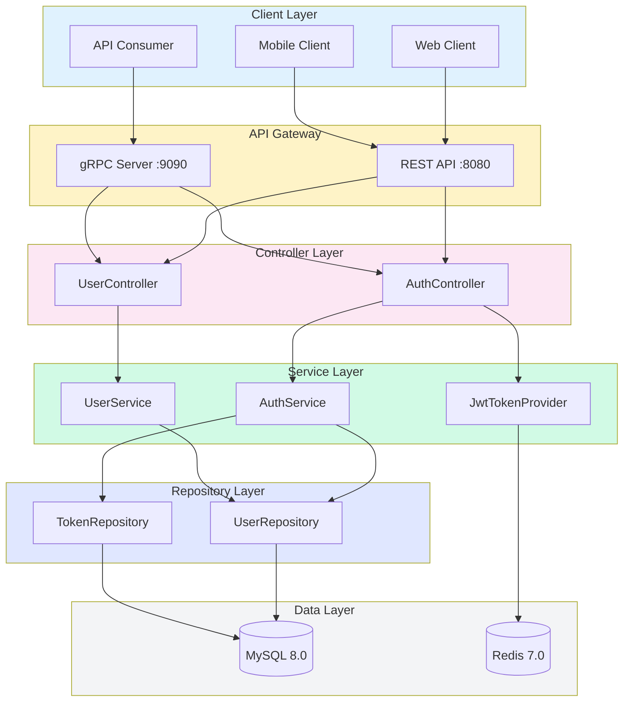
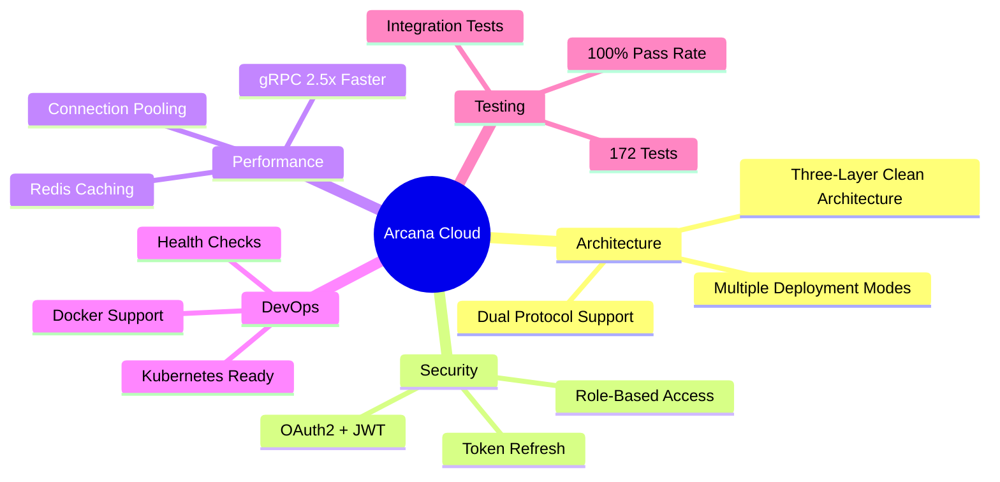
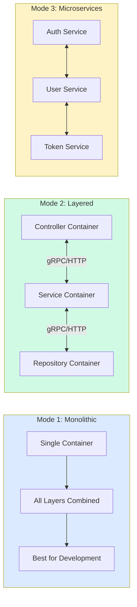
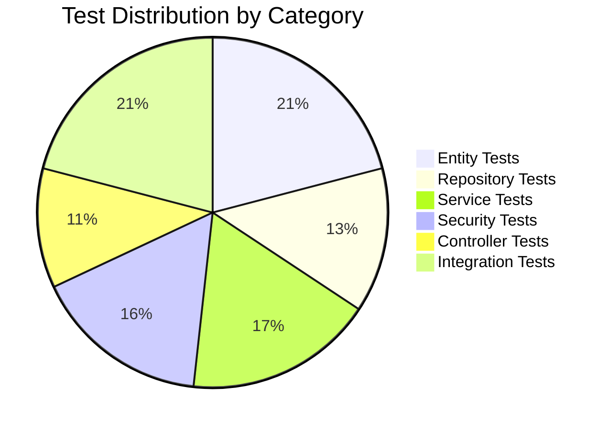
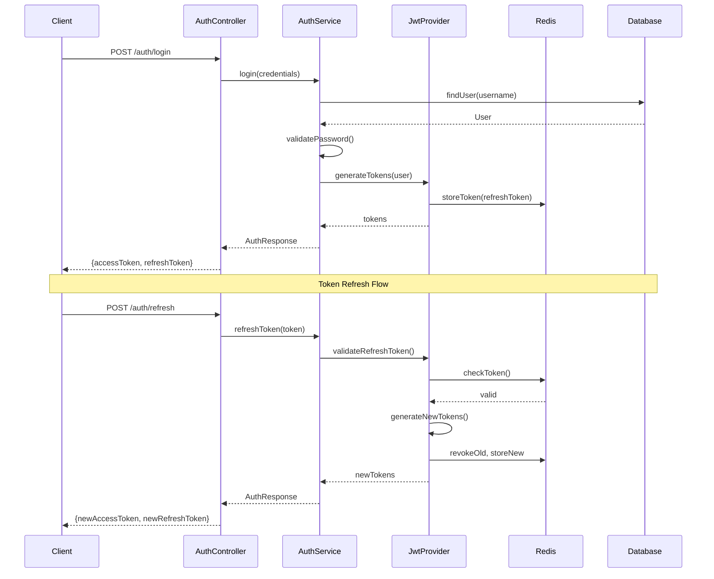

# Arcana Cloud Spring Boot

<div align="center">


**Enterprise-grade microservices platform with gRPC-first architecture**

[](docs/test-report.html)
[]()
[]()
[]()

</div>

---

## Overview

A production-ready enterprise platform built with **Spring Boot 4.0** and **Java 21**, featuring a gRPC-first architecture that delivers **2.5x faster** performance compared to HTTP REST endpoints. The system supports three flexible deployment modes and emphasizes clean architecture principles.

## Architecture



## Key Features



## Project Quality Metrics

<div align="center">

| Metric | Score | Status |
|:------:|:-----:|:------:|
| **Overall Grade** | A+ | Excellent |
| **Test Coverage** | 100% | All Tests Pass |
| **Architecture** | 48/50 | 96% |
| **Code Quality** | 18/20 | 90% |
| **Documentation** | 9/10 | 90% |

</div>

## Performance Benchmarks

```mermaid
xychart-beta
    title "gRPC vs HTTP REST Performance (ms)"
    x-axis ["Get User", "List Users", "Create User", "Update User", "Delete User"]
    y-axis "Response Time (ms)" 0 --> 20
    bar [9.0, 11.0, 16.0, 14.0, 12.0]
    bar [1.5, 9.0, 12.0, 10.0, 8.0]
```



| Operation | HTTP (ms) | gRPC (ms) | Speedup |
|-----------|-----------|-----------|---------|
| Get User | ~9.0 | ~1.5 | **6.0x** |
| List Users | ~11.0 | ~9.0 | 1.2x |
| Create User | ~16.0 | ~12.0 | 1.3x |
| Update User | ~14.0 | ~10.0 | 1.4x |
| Delete User | ~12.0 | ~8.0 | 1.5x |
| **Average** | ~12.5 | ~7.5 | **2.5x** |

## Deployment Modes



| Mode | Containers | Communication | Best For |
|------|------------|---------------|----------|
| **Monolithic** | 1 | In-process | Development, Small deployments |
| **Layered** | 3+ | gRPC/HTTP | Production, Balanced scaling |
| **Microservices** | 11+ | gRPC/HTTP | Enterprise, Maximum scalability |

## Test Suite Overview



### Test Results Summary

| Category | Test Class | Tests | Status |
|----------|------------|-------|--------|
| Entity | UserTest | 13 | Passed |
| Entity | OAuthTokenTest | 14 | Passed |
| Entity | UserRoleTest | 9 | Passed |
| Repository | UserRepositoryTest | 12 | Passed |
| Repository | OAuthTokenRepositoryTest | 11 | Passed |
| Service | UserServiceTest | 14 | Passed |
| Service | AuthServiceTest | 16 | Passed |
| Security | JwtTokenProviderTest | 14 | Passed |
| Security | UserPrincipalTest | 14 | Passed |
| Controller | AuthControllerTest | 4 | Passed |
| Controller | UserControllerTest | 5 | Passed |
| Mapper | UserMapperTest | 10 | Passed |
| Integration | AuthWorkflowTest | 8 | Passed |
| Integration | UserManagementWorkflowTest | 10 | Passed |
| Integration | ValidationTest | 18 | Passed |
| **Total** | **15 Classes** | **172** | **100% Pass** |

## Tech Stack

```mermaid
flowchart LR
    subgraph Core["Core Framework"]
        JAVA[Java 21 LTS]
        SB[Spring Boot 4.0]
        SEC[Spring Security 6.3]
    end

    subgraph Data["Data Layer"]
        JPA[Spring Data JPA]
        FLY[Flyway Migrations]
        MS[MapStruct]
    end

    subgraph Comm["Communication"]
        GRPC2[gRPC + Protobuf]
        REST2[REST + JSON]
    end

    subgraph Infra["Infrastructure"]
        MYSQL2[MySQL 8.0]
        REDIS2[Redis 7.0]
        DOCK[Docker]
        K8S[Kubernetes]
    end

    Core --> Data
    Data --> Comm
    Comm --> Infra

    style Core fill:#d1fae5
    style Data fill:#dbeafe
    style Comm fill:#fef3c7
    style Infra fill:#fce7f3
```



## Quick Start

### Prerequisites

- Java 21+
- Gradle 8.x
- Docker & Docker Compose
- MySQL 8.0+ (or use Docker)
- Redis 7.0+ (or use Docker)

### 1. Clone and Setup

```bash
# Clone the repository
git clone https://github.com/jrjohn/arcana-cloud-springboot.git
cd arcana-cloud-springboot

# Copy environment file
cp .env.example .env
# Edit .env with your configuration
```

### 2. Run with Docker (Recommended)

**Monolithic Mode:**
```bash
./scripts/start-docker-monolithic.sh
```

**Layered Mode (gRPC):**
```bash
./scripts/start-layered.sh
```

**Layered Mode (HTTP):**
```bash
docker-compose -f deployment/layered/docker-compose-http.yml up --build
```

### 3. Run Locally (Development)

```bash
# Start MySQL and Redis
docker-compose -f deployment/monolithic/docker-compose.yml up -d mysql redis

# Build and run
./gradlew bootRun
```

### 4. Access the Application

| Service | URL |
|---------|-----|
| REST API | http://localhost:8080 |
| Swagger UI | http://localhost:8080/swagger-ui.html |
| API Docs | http://localhost:8080/v3/api-docs |
| Health Check | http://localhost:8080/actuator/health |
| gRPC Server | localhost:9090 |

## API Endpoints

### Authentication

| Method | Endpoint | Description |
|--------|----------|-------------|
| `POST` | `/api/v1/auth/register` | Register new user |
| `POST` | `/api/v1/auth/login` | Login |
| `POST` | `/api/v1/auth/refresh` | Refresh token |
| `POST` | `/api/v1/auth/logout` | Logout |
| `POST` | `/api/v1/auth/logout-all` | Logout all sessions |

### Users (Admin)

| Method | Endpoint | Description |
|--------|----------|-------------|
| `GET` | `/api/v1/users` | List all users |
| `GET` | `/api/v1/users/{id}` | Get user by ID |
| `POST` | `/api/v1/users` | Create user |
| `PUT` | `/api/v1/users/{id}` | Update user |
| `DELETE` | `/api/v1/users/{id}` | Delete user |

## Project Structure

```
arcana-cloud-springboot/
├── build.gradle.kts                # Gradle build configuration
├── src/main/java/com/arcana/cloud/
│   ├── ArcanaCloudApplication.java
│   ├── config/                     # Configuration classes
│   ├── controller/                 # REST controllers
│   │   └── internal/               # Internal HTTP controllers
│   ├── service/                    # Business logic
│   │   ├── interfaces/
│   │   ├── impl/
│   │   ├── grpc/                   # gRPC services
│   │   └── client/                 # gRPC/HTTP clients
│   ├── repository/                 # Data access
│   ├── entity/                     # JPA entities
│   ├── dto/                        # Data transfer objects
│   ├── mapper/                     # MapStruct mappers
│   ├── security/                   # Security components
│   ├── exception/                  # Exception handling
│   └── util/                       # Utilities
├── src/main/proto/                 # Protocol Buffer definitions
├── src/main/resources/
│   ├── application.properties
│   └── db/migration/               # Flyway migrations
├── src/test/java/                  # Test classes (172 tests)
│   ├── entity/                     # Entity tests
│   ├── repository/                 # Repository tests
│   ├── service/                    # Service tests
│   ├── controller/                 # Controller tests
│   ├── security/                   # Security tests
│   ├── mapper/                     # Mapper tests
│   └── integration/                # Integration tests
├── deployment/                     # Docker & K8s configs
│   ├── monolithic/
│   ├── layered/
│   └── kubernetes/
├── docs/                           # Documentation
│   └── test-report.html            # Test report
└── scripts/                        # Utility scripts
```

## Security Implementation



## Testing

```bash
# Run all tests
./gradlew test

# Run with coverage report
./gradlew test jacocoTestReport

# View test report
open build/reports/tests/test/index.html

# View coverage report
open build/reports/jacoco/test/html/index.html

# View fancy test report
open docs/test-report.html
```

## Kubernetes Deployment

```bash
# Create namespace
kubectl apply -f deployment/kubernetes/namespace.yaml

# Apply configurations
kubectl apply -f deployment/kubernetes/configmap.yaml
kubectl apply -f deployment/kubernetes/secrets.yaml

# Deploy services
kubectl apply -f deployment/kubernetes/repository-deployment.yaml
kubectl apply -f deployment/kubernetes/service-deployment.yaml
kubectl apply -f deployment/kubernetes/controller-deployment.yaml
kubectl apply -f deployment/kubernetes/services.yaml
kubectl apply -f deployment/kubernetes/ingress.yaml
```

## Environment Variables

| Variable | Description | Default |
|----------|-------------|---------|
| `DATABASE_URL` | MySQL connection URL | `jdbc:mysql://localhost:3306/arcana_cloud` |
| `DATABASE_USERNAME` | Database username | `arcana` |
| `DATABASE_PASSWORD` | Database password | `arcana_pass` |
| `REDIS_HOST` | Redis host | `localhost` |
| `REDIS_PORT` | Redis port | `6379` |
| `JWT_SECRET` | JWT signing secret (min 32 chars) | - |
| `JWT_EXPIRATION` | Access token expiration (ms) | `3600000` |
| `DEPLOYMENT_MODE` | Deployment mode | `monolithic` |
| `DEPLOYMENT_LAYER` | Layer for layered mode | - |
| `COMMUNICATION_PROTOCOL` | Protocol (grpc/http) | `grpc` |

## Default Credentials

| Username | Password | Role |
|----------|----------|------|
| admin | Admin@123 | ADMIN |

## Contributing

1. Fork the repository
2. Create your feature branch (`git checkout -b feature/amazing-feature`)
3. Commit your changes (`git commit -m 'Add amazing feature'`)
4. Push to the branch (`git push origin feature/amazing-feature`)
5. Open a Pull Request

## License

MIT License - see [LICENSE](LICENSE) file for details.

---

<div align="center">

**Built with Spring Boot 4.0 | Java 21 | gRPC**

</div>
