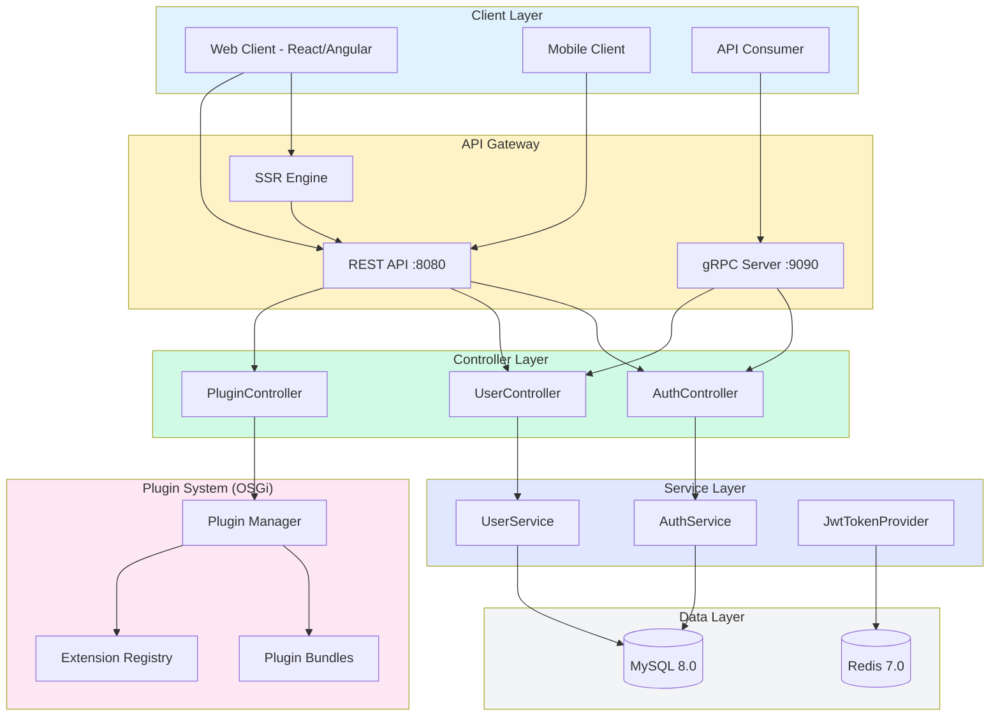
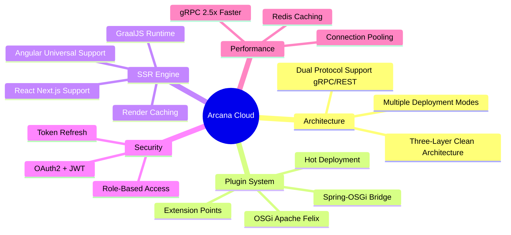
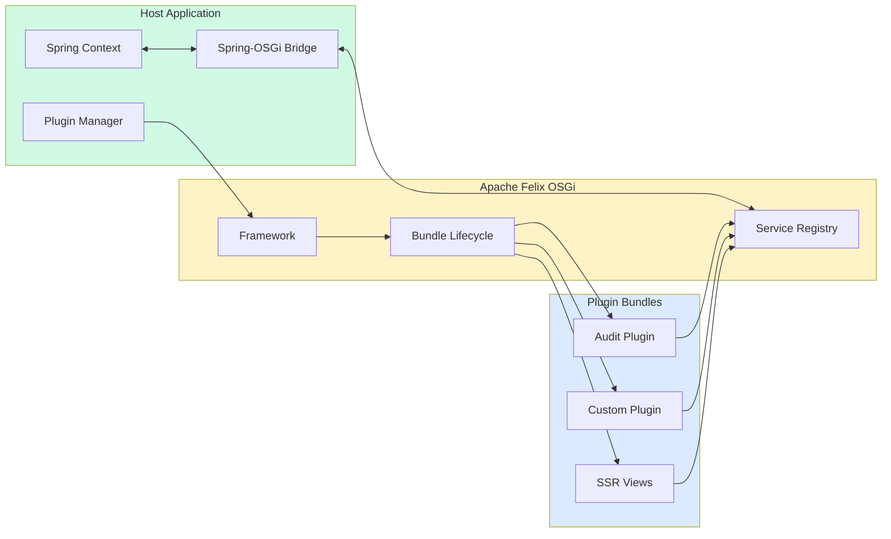
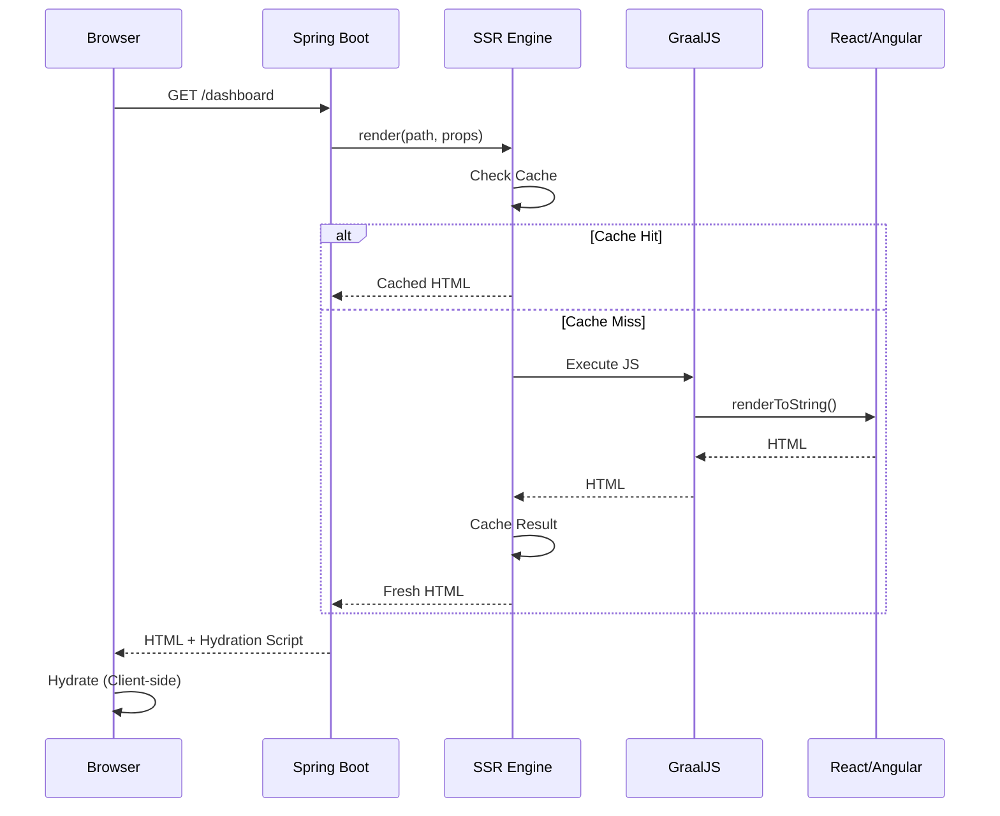

# Arcana Cloud Spring Boot - Enterprise Java Microservices Platform

[](#architecture)
[](https://openjdk.org/)
[](https://spring.io/projects/spring-boot)
[](https://grpc.io/)
[](https://felix.apache.org/)
[]()
[](docs/test-report.html)
[]()
[](https://google.github.io/styleguide/javaguide.html)
[](LICENSE)

Enterprise-grade cloud platform with **gRPC-first architecture** (2.5x faster than HTTP REST), **OSGi Plugin System** (Apache Felix) for hot-deployable extensions, **Server-Side Rendering** with GraalJS for React and Angular, supporting dual-protocol communication and three flexible deployment modes (Monolithic, Layered, Microservices).

## Architecture



## Key Features



## Plugin System (OSGi)

The platform features a JIRA-style plugin architecture using Apache Felix OSGi:



### Plugin Extension Points

| Extension | Description | Example |
|-----------|-------------|---------|
| `@RestEndpointExtension` | Add REST endpoints | `/api/v1/plugins/audit/entries` |
| `@ServiceExtension` | Register services | `AuditService` |
| `@EventListenerExtension` | Handle platform events | `UserEventListener` |
| `@ScheduledJobExtension` | Scheduled tasks | `AuditCleanupJob` |
| `@SSRViewExtension` | SSR-rendered views | Plugin dashboards |
| `@WebFragmentExtension` | UI components | Menu items, panels |

### Creating a Plugin

```java
// Plugin main class
@ArcanaPlugin(
    key = "com.example.myplugin",
    name = "My Plugin",
    version = "1.0.0"
)
public class MyPlugin implements Plugin {
    @Override
    public void onEnable() {
        // Plugin enabled
    }

    @Override
    public void onDisable() {
        // Plugin disabled
    }
}

// REST extension
@RestEndpointExtension(
    key = "my-api",
    path = "/api/v1/plugins/myplugin"
)
@RestController
public class MyPluginController {
    @GetMapping("/hello")
    public String hello() {
        return "Hello from plugin!";
    }
}
```

### Plugin Descriptor (arcana-plugin.xml)

```xml
<arcana-plugin key="com.example.myplugin" name="My Plugin" version="1.0.0">
    <plugin-info>
        <description>My awesome plugin</description>
        <vendor name="My Company" url="https://example.com"/>
        <min-platform-version>1.0.0</min-platform-version>
    </plugin-info>

    <service-extension key="my-service"
                       interface="com.example.MyService"
                       class="com.example.MyServiceImpl"/>

    <rest-extension key="my-rest"
                    path="/api/v1/plugins/myplugin"
                    class="com.example.MyController"/>

    <database-migration>
        <location>db/migration</location>
        <table-prefix>plugin_my_</table-prefix>
    </database-migration>
</arcana-plugin>
```

## Server-Side Rendering (SSR)

The SSR Engine supports both React (Next.js) and Angular Universal:



### SSR Configuration

```yaml
arcana:
  ssr:
    enabled: true
    react-enabled: true
    angular-enabled: true
    react-app-dir: arcana-web/react-app
    angular-app-dir: arcana-web/angular-app
    cache-enabled: true
    default-cache-duration: 60
    graal-pool-size: 4
    render-timeout: 5000
    use-external-node: false  # Set true for production
    node-server-url: http://localhost:3001
```

## Project Structure

```
arcana-cloud-springboot/
├── build.gradle.kts                 # Root build configuration
├── settings.gradle.kts              # Subproject definitions
│
├── src/main/java/                   # Main application
│   └── com/arcana/cloud/
│       ├── controller/              # REST controllers
│       ├── service/                 # Business logic
│       ├── repository/              # Data access
│       ├── entity/                  # JPA entities
│       └── security/                # Security components
│
├── arcana-plugin-api/               # Plugin SDK
│   └── src/main/java/
│       └── com/arcana/cloud/plugin/
│           ├── api/                 # Core interfaces
│           ├── extension/           # Extension annotations
│           ├── event/               # Event classes
│           └── lifecycle/           # Lifecycle management
│
├── arcana-plugin-runtime/           # OSGi Runtime
│   └── src/main/java/
│       └── com/arcana/cloud/plugin/runtime/
│           ├── osgi/                # Felix framework
│           ├── bridge/              # Spring-OSGi bridge
│           └── extension/           # Extension registry
│
├── arcana-ssr-engine/               # SSR Engine
│   └── src/main/java/
│       └── com/arcana/cloud/ssr/
│           ├── renderer/            # React/Angular renderers
│           ├── cache/               # Render caching
│           └── context/             # Request context
│
├── plugins/                         # Plugin bundles
│   └── arcana-audit-plugin/         # Sample audit plugin
│       ├── src/main/java/
│       ├── src/main/resources/
│       │   ├── arcana-plugin.xml
│       │   └── db/migration/
│       └── build.gradle.kts
│
├── arcana-web/                      # Web applications
│   ├── react-app/                   # Next.js application
│   │   ├── src/
│   │   │   ├── pages/
│   │   │   ├── components/
│   │   │   ├── plugins/             # Plugin views
│   │   │   └── services/
│   │   └── package.json
│   │
│   └── angular-app/                 # Angular Universal
│       ├── src/
│       │   └── app/
│       │       ├── pages/
│       │       ├── components/
│       │       ├── plugins/
│       │       └── services/
│       └── package.json
│
├── deployment/                      # Docker & K8s configs
│   ├── monolithic/
│   ├── layered/
│   └── kubernetes/
│
└── docs/                            # Documentation
    └── plugin-development-guide.md
```

## Quick Start

### Prerequisites

- Java 21+
- Gradle 8.x
- Docker & Docker Compose
- Node.js 20+ (for web apps)
- MySQL 8.0+ / Redis 7.0+

### 1. Clone and Setup

```bash
git clone https://github.com/jrjohn/arcana-cloud-springboot.git
cd arcana-cloud-springboot
cp .env.example .env
```

### 2. Build the Project

```bash
# Build all Java modules
./gradlew build

# Build React app
cd arcana-web/react-app && npm install && npm run build

# Build Angular app
cd arcana-web/angular-app && npm install && npm run build:ssr
```

### 3. Run with Docker

```bash
# Monolithic mode
./scripts/start-docker-monolithic.sh

# Layered mode
./scripts/start-layered.sh
```

### 4. Install a Plugin

```bash
# Copy plugin JAR to plugins directory
cp plugins/arcana-audit-plugin/build/libs/*.jar plugins/

# Plugins are automatically discovered and loaded
```

### 5. Access the Application

| Service | URL |
|---------|-----|
| REST API | http://localhost:8080 |
| Swagger UI | http://localhost:8080/swagger-ui.html |
| React App | http://localhost:3000 |
| Angular App | http://localhost:4000 |
| gRPC Server | localhost:9090 |
| SSR Status | http://localhost:8080/api/v1/ssr/status |

## API Endpoints

### Authentication

| Method | Endpoint | Description |
|--------|----------|-------------|
| `POST` | `/api/v1/auth/register` | Register new user |
| `POST` | `/api/v1/auth/login` | Login |
| `POST` | `/api/v1/auth/refresh` | Refresh token |
| `POST` | `/api/v1/auth/logout` | Logout |

### Plugins

| Method | Endpoint | Description |
|--------|----------|-------------|
| `GET` | `/api/v1/plugins` | List all plugins |
| `GET` | `/api/v1/plugins/{key}` | Get plugin details |
| `POST` | `/api/v1/plugins/{key}/enable` | Enable plugin |
| `POST` | `/api/v1/plugins/{key}/disable` | Disable plugin |
| `POST` | `/api/v1/plugins/install` | Install plugin (multipart) |
| `DELETE` | `/api/v1/plugins/{key}` | Uninstall plugin |

### SSR

| Method | Endpoint | Description |
|--------|----------|-------------|
| `POST` | `/api/v1/ssr/react/{component}` | Render React component |
| `POST` | `/api/v1/ssr/angular/{component}` | Render Angular component |
| `POST` | `/api/v1/ssr/plugin/{key}/{view}` | Render plugin view |
| `GET` | `/api/v1/ssr/status` | SSR engine status |
| `DELETE` | `/api/v1/ssr/cache` | Clear SSR cache |

## Performance Benchmarks

| Operation | HTTP (ms) | gRPC (ms) | Speedup |
|-----------|-----------|-----------|---------|
| Get User | ~9.0 | ~1.5 | **6.0x** |
| List Users | ~11.0 | ~9.0 | 1.2x |
| Create User | ~16.0 | ~12.0 | 1.3x |
| Update User | ~14.0 | ~10.0 | 1.4x |
| Delete User | ~12.0 | ~8.0 | 1.5x |
| **Average** | ~12.5 | ~7.5 | **2.5x** |

## Environment Variables

| Variable | Description | Default |
|----------|-------------|---------|
| `DATABASE_URL` | MySQL connection URL | `jdbc:mysql://localhost:3306/arcana_cloud` |
| `DATABASE_USERNAME` | Database username | `arcana` |
| `DATABASE_PASSWORD` | Database password | `arcana_pass` |
| `REDIS_HOST` | Redis host | `localhost` |
| `REDIS_PORT` | Redis port | `6379` |
| `JWT_SECRET` | JWT signing secret | - |
| `DEPLOYMENT_MODE` | Deployment mode | `monolithic` |
| `ARCANA_SSR_ENABLED` | Enable SSR | `true` |
| `ARCANA_SSR_REACT_ENABLED` | Enable React SSR | `true` |
| `ARCANA_SSR_ANGULAR_ENABLED` | Enable Angular SSR | `true` |

## Testing

```bash
# Run all tests
./gradlew test

# Run with coverage
./gradlew test jacocoTestReport

# View test report
open build/reports/tests/test/index.html
```

## Documentation

- [Plugin Development Guide](docs/plugin-development-guide.md)
- [API Documentation](http://localhost:8080/swagger-ui.html)
- [Test Report](docs/test-report.html)

## Contributing

1. Fork the repository
2. Create your feature branch (`git checkout -b feature/amazing-feature`)
3. Commit your changes (`git commit -m 'Add amazing feature'`)
4. Push to the branch (`git push origin feature/amazing-feature`)
5. Open a Pull Request

## License

MIT License - see [LICENSE](LICENSE) file for details.

---

<div align="center">

**Built with Spring Boot 4.0 | Java 21 | OSGi | GraalJS | React | Angular**

</div>
